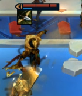
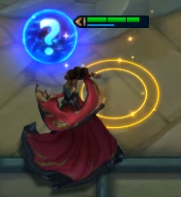
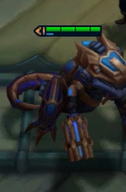
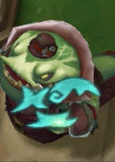
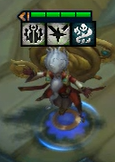

# TFT Champion Image Dataset

**Course:** Undergraduate AI Capstone, NYCU Spr2026
**Project:** #1 — Dataset Construction and Analysis
**Student ID:** 313605010

## Overview

A self-collected image classification dataset of TFT (Teamfight Tactics) champion units, captured from in-game screenshots.

| Class | Count |
|-------|-------|
| Azir | 49 |
| Mel | 57 |
| T-Hex | 53 |
| TahmKench | 40 |
| Zilean | 32 |
| **Total** | **231** |

## Data Type

- **Format:** RGB images (PNG), non-fixed size
- **Input size used for training:** 224 × 224 pixels (resized at training time)
- **Labels:** Folder name = class name (one folder per champion)

## Collection Process

Images were collected by screen-recording the author's own TFT gameplay sessions. Individual champion images were then manually clipped from the recordings, with bounding regions adjusted by hand to tightly crop around each champion unit.

Each champion was captured across multiple game states (different board positions, star levels, equipped items, and attack animations) to introduce natural intra-class variation. Images were manually reviewed and organized into per-class folders.

**Hardware/Software:** Standard gaming PC, Riot Games TFT client (PC).

## Dataset Structure

```
new_dataset/
├── Azir/
├── Mel/
├── T-Hex/
├── TahmKench/
└── Zilean/
```

## Examples

One sample image per class (all captured from in-game screenshots):

| Azir | Mel | T-Hex | TahmKench | Zilean |
|------|-----|-------|-----------|--------|
|  |  |  |  |  |

## Notes

- The dataset is moderately imbalanced (Zilean: 32, Mel: 57).
- All images are original screen recordings; no images were sourced from existing public datasets.
- Image filenames follow the convention \`ClassName_001.png\`, \`ClassName_002.png\`, etc.
